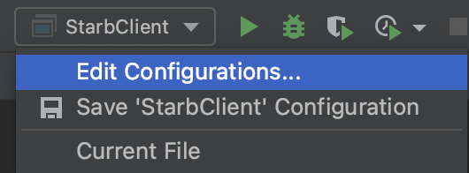

# Star Battle

Project includes both client and server code.

## Client

### Before Running

You'll need to sign in or authenticate yourself as a user. As of March 24, 2022, we have a mocked authentication system
that uses program arguments to achieve login. 

Steps to log in:

> Make sure IntelliJ is running and on starb-webb repo before preceding on the next steps

1) Click over to the run configuration for StarbClient (next to the green run button)

2) Click "edit configurations"
 
3) In the program arguments options text field, add `-username=test.` The argument username is required field followed by any username that is not currently in `src/main/resources/webb/data/userdata.json`

Now, you will be able to start the program with no problems!

### Java Client

To start the Java client: `./gradlew run`

Code located in: `src/main/java/starb/client`

### HTML/CSS/Javascript client.  

Start server (see below) then open browser and go to:

http://localhost:1390/client/index.html

HTML/JS/CSS files located under: `static/client`

## Server

To start server:  `./gradlew bootRun`

[Starbo API Specification](https://editor.swagger.io/?url=https://gist.githubusercontent.com/chrishollandaise/db70c557e5dcafb2f3ba685a1fcad2a9/raw/789980519e66f6c27676d58e1ca680c2b9aaf946/gistfile1.txt)

## Tests

Tests are located in `src/test/java`.  To execute tests using IntelliJ,
use the green arrow.  To execute using Gradle run:

`./gradlew test`
