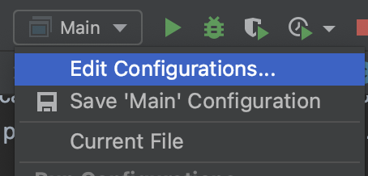

# Star Battle 

Project includes both client and server code.

### To Start Game

You'll need to sign in or authenticate yourself as a user. As of May 16, 2023, we have a mocked authentication system
that uses program arguments to achieve login. 

Steps to Play Game:

> Make sure IntelliJ is running and on starb-webb repo before preceding on the next steps

1. Click over to the run configuration for StarbClient (next to the green run button)

2. Click "edit configurations"
 

3. In the program arguments options text field, add `-username=.` put a username of your choice. The argument username is required field followed by any username that is not currently in `src/main/resources/webb/data/userdata.json`

4. To start the database run docker and run command `docker compose up -d`

5. Start WebbServer. Click Start Server Button below. 

6. If are you using gradlew use this command line in terminal and choose a username of your choice: ` - ./gradlew run --args="-username="` 
      Code located in: `src/main/java/Webb/Main`

Now, You should be able to Play! Enjoy our game!!

-------------------------------------------------------------------

## Server

To start server:  `./gradlew bootRun`

[Starbo API Specification](https://editor.swagger.io/?url=https://gist.githubusercontent.com/chrishollandaise/db70c557e5dcafb2f3ba685a1fcad2a9/raw/789980519e66f6c27676d58e1ca680c2b9aaf946/gistfile1.txt)

