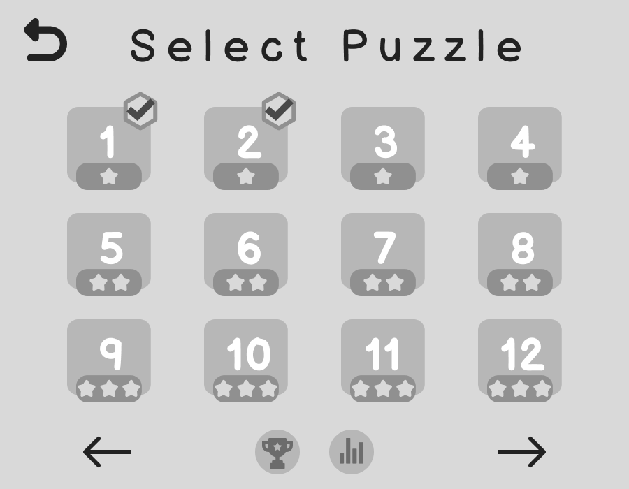

# Iteration 1 UI Sketch/Design

## Project Information
* **Team:** Webb
* **Primary Designer:** Chris Holland
* **Course/Semester:** CS390 Spring 2023

# Table of Contents
- [Iteration 1 UI Sketch/Design](#iteration-1-ui-sketchdesign)
  - [Project Information](#project-information)
- [Table of Contents](#table-of-contents)
  - [Project Description](#project-description)
  - [Design Philosophy](#design-philosophy)
  - [Sketches](#sketches)
    - [Main Menu](#main-menu)
    - [Level Select](#level-select)
    - [Game Screen](#game-screen)
    - [Game Summary](#game-summary)
    - [Leaderboard](#leaderboard)
    - [Statistics](#statistics)
    - [Credits](#credits)
  - [Components](#components)
    - [Level Paginator](#level-paginator)
      - [Properties](#properties)
    - [Buttons](#buttons)
      - [Button (Open Modal)](#button-open-modal)
      - [Button (Close Modal)](#button-close-modal)
      - [Change Main Display Button](#change-main-display-button)
      - [Game Buttons](#game-buttons)
      - [Puzzle Button](#puzzle-button)
      - [Toggles (Button Subtype)](#toggles-button-subtype)
        - [Highlight Toggle (Game)](#highlight-toggle-game)
    - [Game Grid](#game-grid)
    - [Modals](#modals)
    - [Progress Bar](#progress-bar)
    - [Leaderboard](#leaderboard-1)
    - [Text Fields](#text-fields)
    - [Timer](#timer)

## Project Description
- Star Battle Odyssey is a Java client application that allows players to complete Star Battle puzzles. This is the user interface design for the game.

## Design Philosophy

> **Disclaimer.** These are wireframes and are not final designs. The designs are subject to change. Many of the designs are placeholders and will be replaced with more detailed designs and color.

## Sketches

- The following sketches are the initial sketches for the user interface design of the game. The sketches are in the order important to the user experience.

### Main Menu

**Figure 1**. The main menu of the game. Features the title, a play button, a credits button, and an exit button.

### Level Select

**Figure 2**. The level select screen of the game. Features a paginated list of levels, with forward and back buttons to navigate between pages. Each level is represented by a number, and difficulty indicated by number of stars. If a level has been completed, there is a checkmark to indicate so. The user can select a level by clicking on it. The user can also click the back button to return to the main menu. Finally, it also includes the statistics and leaderboard buttons.

### Game Screen

**Figure 3**. The game screen of the game. Features a of grid and a right side pane. The cells in the grid be clicked on by the user to either put a star or X mark. The side pane contains information regarding the current puzzle information, the time, a check button to check the puzzle, a highlight moves button to automatically place Xs, and a reset button to reset the puzzle. The user can also see how many stars they have left, how many players have completed the puzzle, and an exit button to return to the level select screen.

### Game Summary

**Figure 4**. The game summary screen of the game. Features a summary of the game, including the time it took to complete the puzzle and progress towards their title. It also includes a button to return to the level select screen or restart the puzzle.

### Leaderboard

**Figure 5**. The leaderboard screen of the game. It is a modal that features a scrollable list of the top players sorted by number of puzzles completed. It also includes a X button to close the modal.

### Statistics

**Figure 6**. The statistics screen of the game. Features the current title of the user, the number of puzzles completed, and global minimum, average, and max solve times. It also includes a X button to return to the level select screen.

### Credits

**Figure 7**. The credits screen of the game. Features the names of the team members and a back button to return to the main menu.

## Components

### Level Paginator

**Figure 8**. The level paginator component. It is a component that allows the user to navigate between pages of levels. 

#### Properties
- The component displays 12 levels per page. 
- Each page will have a forward and back button to navigate between pages. Except for the first page, which will only have a forward button, and the last page, which will only have a back button.
- After either the forward or back button is clicked, the component will display the next or previous 12 levels, respectively.

### Buttons

**General Properties**

- Buttons will have a hover state that at least changes the cursor to a pointer.
- Pressing a button will have a visual effect to indicate that it has been pressed.
- Buttons come in many forms. They can have a variety of shapes, colors, and sizes. They can also have text, icons, or both.

#### Button (Open Modal)

**Figure 9**. Buttons that open modals. These buttons will open a modal when clicked.

#### Button (Close Modal)

**Figure 10**. Button that close modals. This button will close the modal when clicked. It is always located in the top right corner of the modal.

#### Change Main Display Button

> Buttons like play button, credits button, back button, exit game button, etc will change the main window view. As opposed to opening a modal.

**Figure 11.** Buttons that changes the main window view. This button will change the main window view to the previous view when clicked. It is always located in the top left corner of the main window.

#### Game Buttons

**Figure 12.** The check button. This button will check the puzzle when clicked. It updates the stars remaining text field. If the highlight toggle is off, it will only highlight incorrect placement of stars at the point it was clicked. 

**Figure 13.** The restart button. This button will reset the puzzle when clicked. Clears all stars and Xs placed. It updates the stars remaining text field to 0.

#### Puzzle Button

**Figure 13.5** The puzzle selection button. When clicked, it will enter the game screen. If puzzle has been completed by the user, it will display a checkmark.

#### Toggles (Button Subtype)
- Toggles, are a special type of button that can switch between states.
- Depending on the state, the toggle will have a different visual appearance.

##### Highlight Toggle (Game)

**Figure 14.** The highlight toggle. This toggle will enable automatic highlighting of incorrect placement of stars when clicked. It will also enable automatic eliminated cells placement.

**Properties**
- This button will be off by default. If the user turns it on, it will only last for that puzzle solving session. So if the user restarts the puzzle, exits the game, or goes to the next puzzle, the toggle will be off by default.
- When off, the icon will be a eye with a slash through it. When on, the icon will be a eye.

### Game Grid

**Figure 15**. The game grid component. It is a component that displays the game grid.

**Properties**
> Cells act a lot like toggles. They can be switched to many different states.
- As the size of the grid increases, the size of the cells will decrease.
- When the user hovers over a cell, it will have a hover state that changes the cursor to a pointer.

> Alternatively, we can cycle through cell states. Left click will cycle through occupied and eliminated. Right click goes in reverse. This would allow a better experience for trackpads or touch screens.

- **When a user left clicks on a cell**, it will place a star. If the cell is occupied or illegal, it will remove the star. If the cell is eliminated, it will remove the X and place a star.
- **When a user right clicks on a cell**, it will place an X. If the cell is eliminated, it will remove the X. If the cell is occupied or illegal, it will remove the star and place an X.
- There are 4 types of cells: empty, occupied, eliminated, and illegal. 
  - **Empty:** no icon is displayed.
  - **Occupied:** a star icon is displayed. If highlight toggle is on, it will be highlighted if the placement is deemed to be incorrect.
  - **Eliminated:** an X icon is displayed. These are unaffected by the highlight toggle.
  - **Illegal:** an occupied cell that is deemed to be an illegal placement. It will be highlighted automatically if the highlight toggle is on.

### Modals 

**Figure 16**. A "dissmissable" modal. This modal will have a X button in the top right corner to close the modal.

**Figure 17**. A "multi-option" modal. This modal will have a footer with multiple buttons to choose from.

> The restart button will reset the puzzle (clear the board, reset the stars remaining text field to 0, and reset the timer). However, it will not remove their previous score.

This particular modal, the game summary modal, has a restart button and exit game button. When they click, it will close the modal and change the main window view to the main menu.

**General Properties**
- Modals are a child window that are attached to the main window.
- Modals are always centered on the main window. Moves with the main window.
- Modals can either have a close button or a footer with button choices.
- Modals cannot be resized or moved.
- Modal will be focused, so it can be enhanced by blurring and/or darkening the main window.

### Progress Bar

**Figure 18**. The progress bar component. It will display the progress of the user in the current level.

**Properties**
- The progress bar will be filled in proportion to the number of levels needed to complete the current level.
- The progress bar may be animated to slide progressively from left to right. This would be on modal open.
- This is calculated locally. It is not fetched from the database.

> Currently, the titles of levels are still being decided. But, a science fiction theme will be used.

### Leaderboard

**Figure 19**. The leaderboard component. It will scrollable list of the players who have completed the most puzzles. 

**Properties**
> We can also look into caching the leaderboard to reduce the number of queries to the database.
- The leaderboard will be sorted by the number of puzzles completed.
- For tie breakers, the leaderboard will be sorted by the total time taken to complete all puzzles. Fastest time will be at the top.
- The leaderboard will show the last queried leaderboard. It will not update automatically.
- Leaderboard will fetch after opening the leaderboard modal. This will be done asynchronously.

### Text Fields

**General Properties**

- Text fields that aren't static will always eagerly update the text field.
- Text fields can either be fetching from database or from the game state.

**Figure 20**. The statistics component. It will display the number of puzzles completed, the total time taken to complete all puzzles, and the average time taken to complete a puzzle.

**Properties**
- Each text field can be fetched from the database.

**Figure 21**. The game info pane. Displays information concerning the current puzzle.

**Properties**
- The stars remaining text field will be fetched from the game state. If auto highlight is on, it will be updated after each click. If auto highlight is off, it will be updated after the check button is clicked.
- Completed by text field will be fetched from the database, and when the puzzle is completed, updated in the database.
- The timer will be fetched from the game state. It will be updated every second.

### Timer

**Figure 22**. The timer component. It will display the time taken to complete the current puzzle.

**Properties**
- The timer will be fetched from the game state. It will be updated every second.
- The timer will be reset when the puzzle is restarted.
- The timer starts when the user clicks on the puzzle grid for the first time.