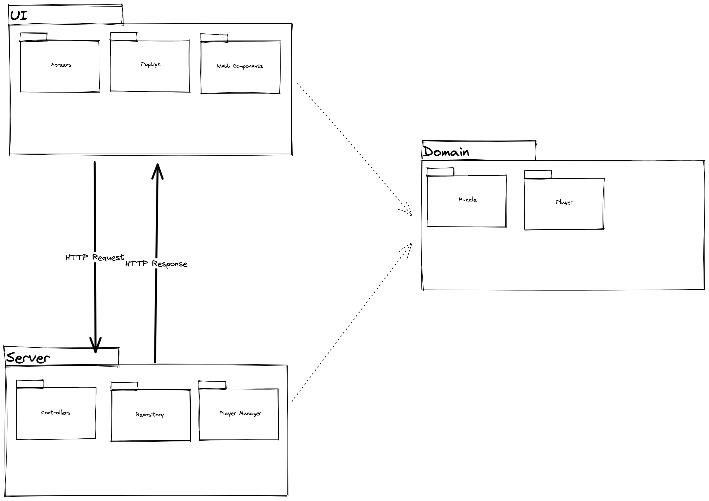

# Package Diagram Explanation

We have divided our project into three primary packages:

1.  UI
2.  Domain
3.  Server

The UI represents our view, with its primary role being to display and provide interactivity for our players. It contains sub-packages such as screens and pop-ups that organize our "Web Components." These custom components offer isolated functionality to enable users to play the game. An example would be the Puzzle component, which allows players to place stars and markers. These components can be wrapped in other components as much as desired, and screens and pop-ups have one or more components. All of our UI is extended from Java Swing.

The domain is responsible for handling logic. This package contains the game logic, such as determining whether a star is in a valid location, as well as the player package.

The third package is our Server, which is responsible for persisting user data and serving as the primary authority for determining certain factors, such as whether the player won a game or where they rank in the leaderboard. It has controllers that are responsible for message passing using HTTP, a repository for persistence and communicating with the database, and finally, a player manager for managing authentication.

Both the server and the UI depend on the domain. The UI for keeping state and the server to send the correct formatted state (data loading).